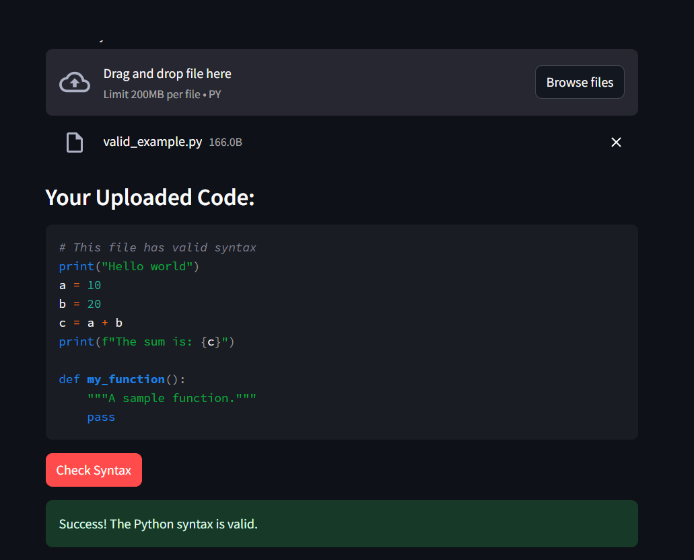

# python_syntax_checker
# Python Syntax Checker Tool 🐍✅

A simple web-based utility built with Streamlit to check Python scripts for syntax errors without executing the code. This tool is designed to help beginner programmers quickly validate their code.

## 📸 Screenshot

*A screenshot of the application in action, showing a syntax error being detected.*



## 🚀 Features

-   **File Upload**: Upload any `.py` script through a user-friendly interface.
-   **Code Display**: View the content of your uploaded script directly in the app.
-   **Instant Syntax Check**: Validates code using Python's built-in `compile()` function.
-   **Clear Feedback**: Displays a success message for valid code or a precise error message with the line number for invalid code.

## 🛠️ Project Setup and Installation

Follow these steps to set up and run the project on your local machine.

### Prerequisites

-   Python 3.7+
-   Git

### Installation

1.  **Clone the repository:**
    ```bash
    git clone [https://github.com/YOUR_USERNAME/YOUR_REPOSITORY_NAME.git](https://github.com/YOUR_USERNAME/YOUR_REPOSITORY_NAME.git)
    cd YOUR_REPOSITORY_NAME
    ```

2.  **Create and activate a virtual environment:**
    ```bash
    # Create the virtual environment
    python -m venv venv

    # Activate on Windows
    venv\Scripts\activate

    # Activate on macOS/Linux
    source venv/bin/activate
    ```

3.  **Install the required packages:**
    ```bash
    pip install -r requirements.txt
    ```

## 🏃‍♀️ How to Run the Project

With the virtual environment activated and dependencies installed, run the following command in your terminal:

```bash
streamlit run app.py
